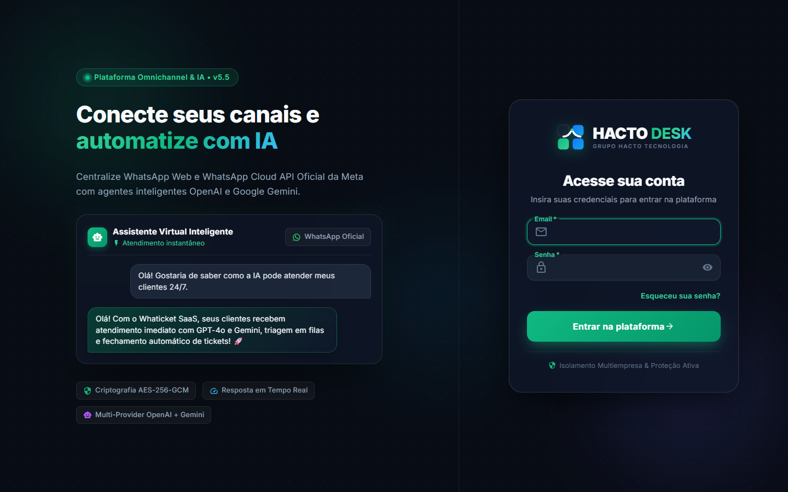
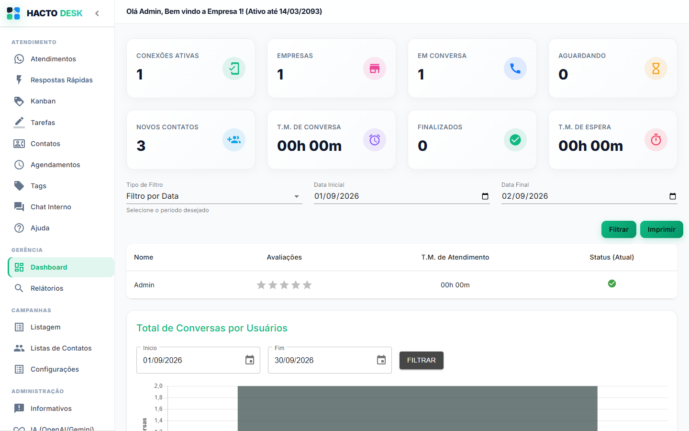
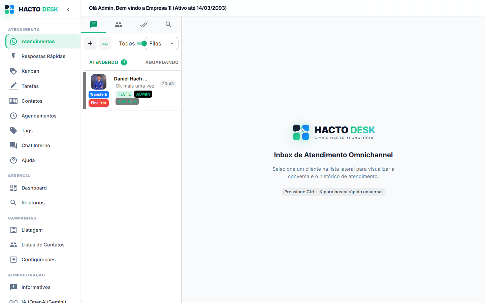
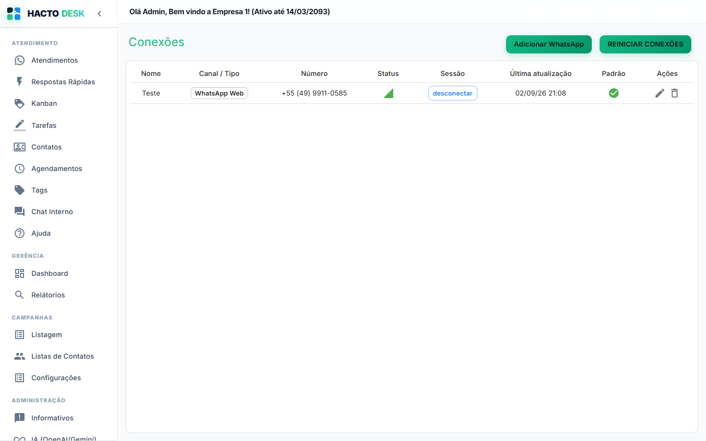
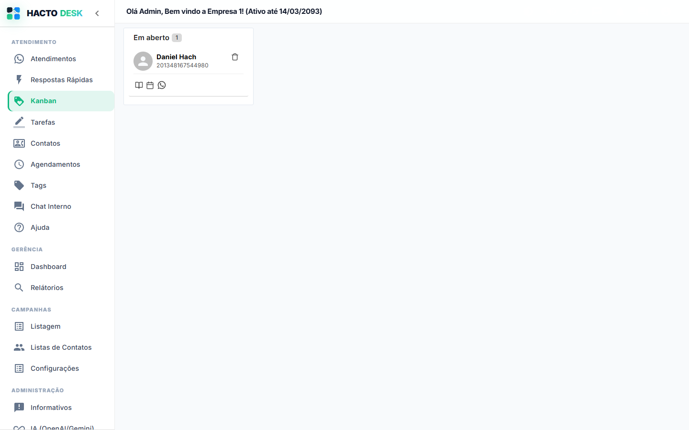
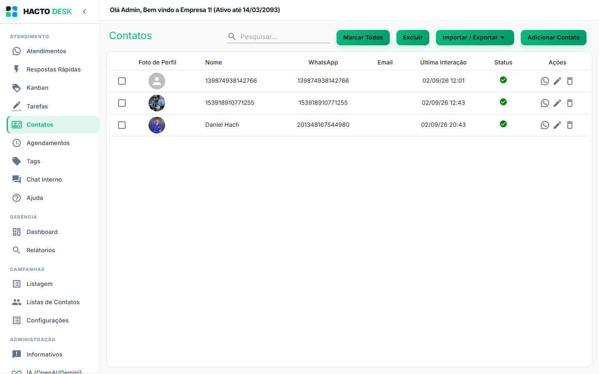
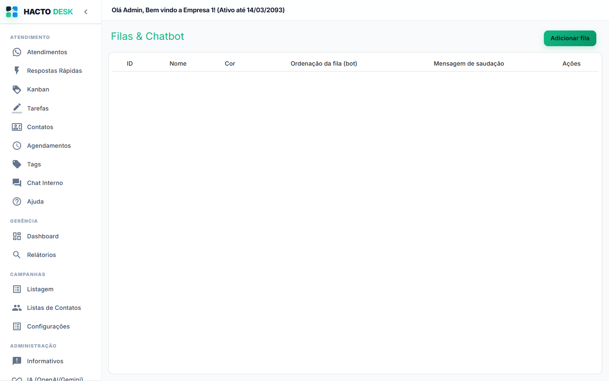
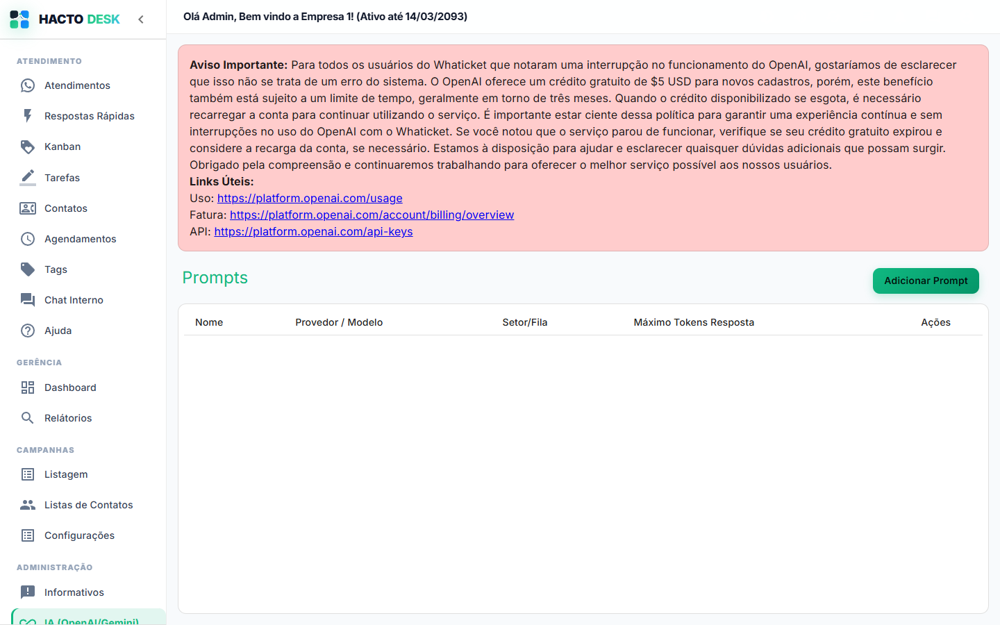
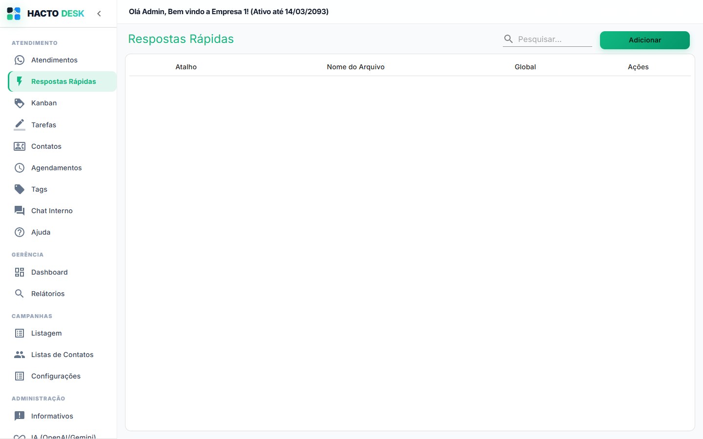
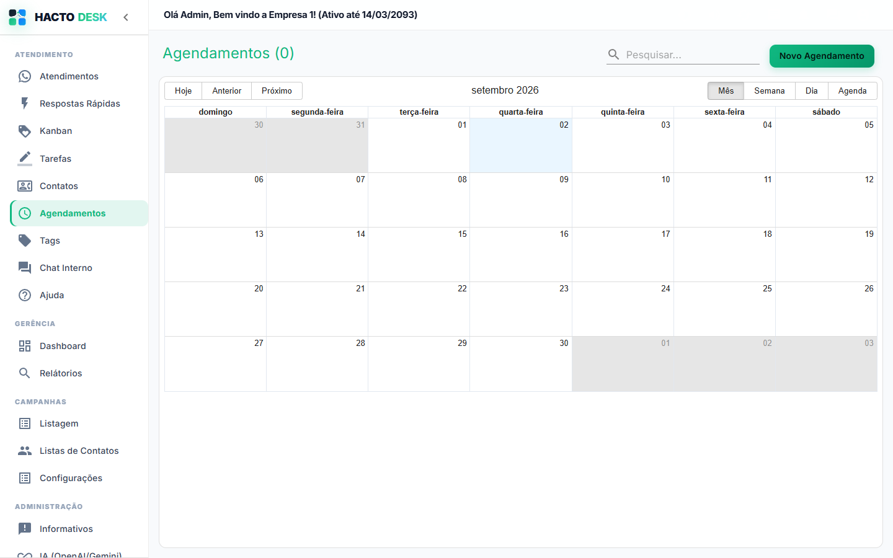

# Hacto Desk

Plataforma de atendimento omnichannel via WhatsApp, com Kanban, campanhas, agendamentos, chat interno e integração com agentes de IA (OpenAI e Google Gemini).



## Principais recursos

- WhatsApp Web (Baileys / QR Code) e WhatsApp Cloud API (Meta Oficial)
- Kanban de atendimentos
- Campanhas de disparo em massa
- Respostas rápidas e chatbot por filas
- Integração com prompts de IA (OpenAI e Gemini)
- Agendamento de mensagens
- Multiempresa com planos configuráveis
- Dashboard e relatórios

## Requisitos

- Node.js 20+
- PostgreSQL
- Redis
- Docker (opcional, recomendado para deploy)

## Rodando com Docker

```bash
docker compose -f docker-compose.yaml -f docker-compose.local.yaml up -d
```

## Estrutura do projeto

- `backend/` — API Node.js/TypeScript (Express, Sequelize, Baileys)
- `frontend/` — Aplicação React (Material-UI)

## Capturas de tela

### Dashboard

Visão geral de conexões ativas, tickets, contatos e tempo médio de atendimento.



### Atendimentos

Inbox omnichannel com filas, transferência e finalização de tickets.



### Conexões

Gerenciamento de números conectados via WhatsApp Web ou Cloud API.



### Kanban

Organização visual dos atendimentos por etapa.



### Contatos

Base de contatos com histórico de interação e status.



### Filas & Chatbot

Configuração de filas de atendimento e fluxo automático do chatbot.



### IA (OpenAI/Gemini)

Cadastro de prompts de IA, com escolha de provedor (OpenAI ou Google Gemini) e modelo.



### Respostas Rápidas

Atalhos de texto para agilizar o atendimento.



### Agendamentos

Calendário de mensagens agendadas.


